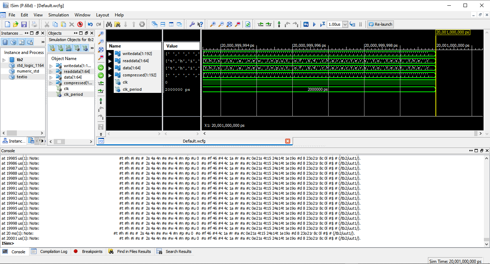
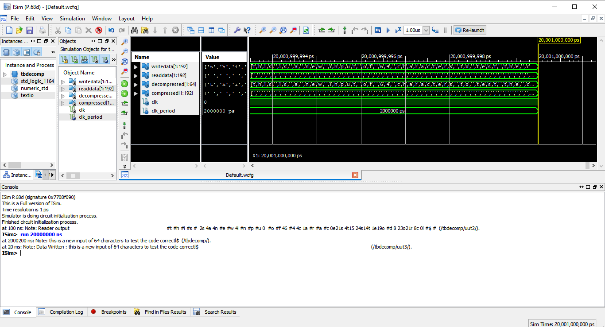

# LZ-Compression
A Digital System Design project, we implemented a text compressor and decompressor based on the famous Limpel - Ziv algorithm in 1978 (LZ78) using VHDL.

## Example
#### Compression Output
input  = this is a new input of 64 characters to test the code correctly  
<pre> output = #t #h #i #s #  2s 4a 4n #e #w 4i #n #p #u 0  #0 #f 46 #4 4c 1a #r #a $c 0e21s 4t15 24s14t 1e19o #d 8 23o21r 8c 0l #$ # </pre>
#### Decompression Output
output = this is a new input of 64 characters to test the code correctl!

### Compression

### Decompression

